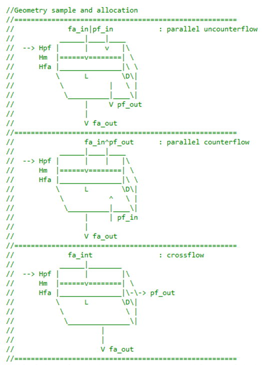

# C-CODE_FOR_MEMBRANE_BASED_MODEL
Membrane-based dehumidification is currently being considered as a promising solution for the building application due to its low cost and very limited energy consumption. Developing a simple and efficient open-source code simulation tool is important for boosting the optimization and evaluation of such device in HVAC community. This paper reports a first-order physics based model which accounts for the fundamental heat and mass transfer of humid-air vapor at feed side to flow stream at permeate side. The current model comprises two membrane mass transfer submodels (i.e. microstructure model and performance map model); and it adopts a segment-by-segment methodology for discretizing heat and mass transfer governing equations. The model is capable of simulating both dehumidifiers and energy recovery ventilators with parallel-flow cross-flow, and counter-flow configurations. The model was validated with the measurements at appropriate device. The practices in dehumidification and energy recovery exchangers are also discussed. The model and open-source codes are expected to become a solid fundament for developing a more comprehensive and accurate membrane-based dehumidification in the future. 

# Readme for the folders of case and code
The README.docx was written by Zhiming Gao (Phone: 865-946-1339, email: gaoz@ornl.gov) The detailed model are reported in the manuscript of “An Open-Source Code for Modeling and Simulation of Membrane-Based Dehumidification and Energy Recovery.”

Document file
The zipped files include two folders: CODE_MODEL and CASES. In the folder of CODE_MODEL, there are totally fifteen source-code files. The source-code files were written in C++. The functions are explained in the Code function. 
In the folder of CASE, there are ten files which include one executable file and 9 input text files for case studies.
•	Membrane_Model.exe is an executable file which can be generated from the source codes in the folder of code_model. The used compiler is Microsoft Visual Studio Community 2015. The executable file can be used directly to study any cases with the format of the attached input files. 
•	9 input files for case studies include a2a104_s3_cr.txt, a2a520_s3_cr.txt, a2v360_caseA_cr.txt, a2v360_caseB_cr.txt, a2v360_caseC_cr.txt, a2v360_caseD_cr.txt, a2v360_caseE_cr.txt, a2v360_caseF_cr.txt, a2a360_caseG_cr.txt. Here, a2a104_s3_cr.txt and a2a520_s3_cr.txt are the input files for the AIR-AIR cases, and the input file can used to repeat the results reported in Figures 8-10 of the manuscript; and a2v360_caseA_cr.txt et.al. are the input files for the AIR-vapor cases where the permeate side is under the condition of vacuum, and these input file can used to repeat the results reported in Figures 4-7 of the manuscript.
 
Code function 
Cmatric.cpp	: The defined routines are used to allocating memory for any variables used in the open-source codes.
Component.cpp	: The defined Class is used to carry out a general heat exchanger component simulation based segment-by segment methodology for various flow configurations. 
HXM.cpp	: The defined Class is used to reanalyze heat exchanger parameters and geometry size, segment size, characteristic length.
Iofile.cpp	: The defined namespace is used to read input data file and generate out data file.
Main.cpp	: This is a Main function to call other functions.
Membrane.cpp	: The namespace of Membrane is defined and is used to calculate membrane mass transport analysis. 
MoistAirVapProperty.cpp : The namespace of MoistAirVapProperty is defined and is used to calculate moist air and vapor properties, and their heat transfer coefficients. .
SegmentSolve.cpp	: The defined Class is used to the heat and mass transport process in feed-side and permeate-side flow for each segment. The solving method is Gaussian elimination. 

Input parameter introduction

length_dev			: length of device, m
deep_dev			: deep of device, m
height_feedchanel		: height of feedair channel, m
height_permeatechanel	: height of permeateflow channel, m
thick_membrane		: membrane thickness, m

segment_length		: segment number of L-direction
segment_deep			: segment number of D-direction
layernum_membrane		: layer number of membrane
flowtype_device	: flow configuration: 1: parallel uncounterflow; 2:parallel counterflow; 0 or 3 or other: crossflow

poreradius_membrane	: pore radius of membrane,m (need it if membrane_model=0)
porosity_membrane	: porosity of membrane,(-) (need it if membrane_model=0)
tortuosity_membrane	: tortuosity of membrane,(-) (need it if membrane_model=0)
thermocond_membrane	: membrane thermocondivity,kW/m-K(need it if membrane_model=0)

mass_feedflow			: mass flow rate @ feedair, kg/s
temp_feedflow			: feedair temp, K
rh_feedflow			: rh@feedair, (dimensionless)
press_feedflow		: feedair pressure, Pa
mass_permeateflow		: mass flow rate @ permeateflow, kg/s
temp_permeateflow		: peameateflow temp, K
rh_permeateflow		: rh@peameateflow, (dimensionless)
press_permeateflow		: peameateflow pressure, Pa

flowcondition_permeate	: 0:A2V,vapor only in permeateflow; 1:A2A,air in permeateflow
membrane_model		: 0: default model; 1: Dais data; 2 constant value-model
htc_correction		: HTC correction (0-1), (-)
ftc_correction		: FTC correction (0-1), (-)
mt_impact_ht			: 0: not enabled; 1: enabled mass permeated on ht impact
memsurf_correction		: membrane surface deflection (0-inf, 1 means perfectly flat)

