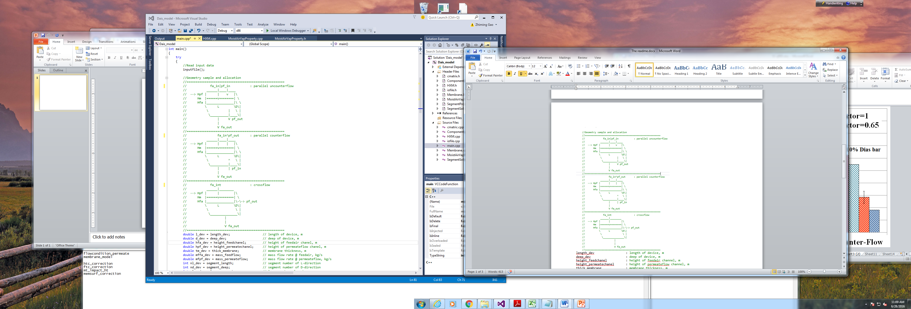

The README was written by Zhiming Gao (Phone 865-946-1339, email gaoz@ornl.gov) The detailed model are reported in the manuscript of “*Z. Gao, O. Abdelaziz, M. Qu. Modeling and Simulation of Membrane-Based Dehumidification and Energy RecoveryProcess. 2017 ASHRAE Winter Conference, Las Vegas, NV, Jan. 28 – Feb. 1, 2017.*”

# Document file

The zipped files include two folders: **CODE\_MODEL** and **CASES**. In the folder of **CODE\_MODEL**, there are totally fifteen source-code files. The source-code files were written in C++. The functions are explained in the Code function.

In the folder of **CASE**, there are ten files which include one executable file and 9 input text files for case studies.

-   `Membrane_Model.exe` is an executable file which can be generated from the source codes in the folder of `code_model`. The used compiler is Microsoft Visual Studio Community 2015. The executable file can be used directly to study any cases with the format of the attached input files.

-   9 input files for case studies include `a2a104_s3_cr.txt`, `a2a520_s3_cr.txt`, `a2v360_caseA_cr.txt`, `a2v360_caseB_cr.txt`, `a2v360_caseC_cr.txt`, `a2v360_caseD_cr.txt`, `a2v360_caseE_cr.txt`, `a2v360_caseF_cr.txt`, `a2v360_caseG_cr.txt`. Here, `a2a104_s3_cr.txt` and `a2a520_s3_cr.txt` are the input files for the AIR-AIR cases, and the input file can used to repeat the results reported in __Figures 4-6__ of the manuscript; and `a2v360_caseA_cr.txt` et. al. are the input files for the AIR-vapor cases where the permeate side is under the condition of vacuum, and these input file can used to repeat the results reported in __Figure 3__ of the manuscript.

# Code function

| Code | Function |
|---------------------------|--------------------------------------------------------------------------------------------------------------------------------------------------------------------|
| `Cmatric.cpp` | The defined routines are used to allocating memory for any variables used in the open-source codes. |
| `Component.cpp` | The defined Class is used to carry out a general heat exchanger component simulation based segment-by segment methodology for various flow configurations. |
| `HXM.cpp` | The defined Class is used to reanalyze heat exchanger parameters and geometry size, segment size, characteristic length. |
| `Iofile.cpp` | The defined namespace is used to read input data file and generate out data file. |
| `Main.cpp` | This is a Main function to call other functions. |
| `Membrane.cpp` | The namespace of Membrane is defined and is used to calculate membrane mass transport analysis. |
| `MoistAirVapProperty.cpp` | The namespace of MoistAirVapProperty is defined and is used to calculate moist air and vapor properties, and their heat transfer coefficients. |
| `SegmentSolve.cpp` | The defined Class is used to the heat and mass transport process in feed-side and permeate-side flow for each segment. The solving method is Gaussian elimination. |

# Input parameter introduction

| Parameter | Description |
|--------------------------|-----------------------------------------------------------------------------------------------------|
| `length_dev` | length of device, m |
| `deep_dev` | deep of device, m |
| `height_feedchanel` | height of feedair channel, m |
| `height_permeatechanel` | height of permeateflow channel, m |
| `thick_membrane` | membrane thickness, m |
|  |  |
| `segment_length` | segment number of L-direction |
| `segment_deep` | segment number of D-direction |
| `layernum_membrane` | layer number of membrane |
| `flowtype_device` | flow configuration: 1: parallel uncounterflow; 2: parallel counterflow; 0 or 3 or other: crossflow |

| Parameter | Description |
|--------------------------|-----------------------------------------------------------------------------------------------------|
| `poreradius_membrane` | pore radius of membrane,m (need it if membrane_model=0) |
| `porosity_membrane` | porosity of membrane,(-) (need it if membrane_model=0) |
| `tortuosity_membrane` | tortuosity of membrane,(-) (need it if membrane_model=0) |
| `thermocond_membrane` | membrane thermocondivity,kW/m-K (need it if membrane_model=0) |

| Parameter | Description |
|--------------------------|-----------------------------------------------------------------------------------------------------|
| `mass_feedflow` | mass flow rate @ feedair, kg/s |
| `temp_feedflow` | feedair temp, K |
| `rh_feedflow` | rh@feedair, (dimensionless) |
| `press_feedflow` | feedair pressure, Pa |
| `mass_permeateflow` | mass flow rate @ permeateflow, kg/s |
| `temp_permeateflow` | peameateflow temp, K |
| `rh_permeateflow` | rh@peameateflow, (dimensionless) |
| `press_permeateflow` | peameateflow pressure, Pa |

| Parameter | Description |
|--------------------------|-----------------------------------------------------------------------------------------------------|
| `flowcondition_permeate` | 0: A2V,vapor only in permeateflow; 1: A2A,air in permeateflow |
| `membrane_model` | 0: default model; 1: Dais data; 2: constant value-model |
| `htc_correction` | HTC correction (0-1), (-) |
| `ftc_correction` | FTC correction (0-1), (-) |
| `mt_impact_ht` | 0: not enabled; 1: enabled mass permeated on ht impact |
| `memsurf_correction` | membrane surface deflection (0-inf, 1 means perfectly flat) |

# Output parameter introduction

## General outputs

| Parameter | Description |
|----------------------|-------------------------------------|
| `tfa_in(c)` | feedair temp @inlet |
| `tfa_out(c)` | feedair temp @outlet |
| `humidfa_in(kg/kg)` | feedair humidity ratio @inlet |
| `humidfa_out(kg/kg)` | feedair humidity ratio @outlet |
| `rhfa_in` | feedair RH @inlet |
| `rhfa_out` | feedair RH @outlet |
| `Pvapfa_in(pa)` | feedair vapor pressure @inlet |
| `Pvapfa_out(pa)` | feedair vapor pressure @outlet |
| `tpf_in(c)` | permeateflow temp @inlet |
| `tpf_out(c)` | permeateflow temp @outlet |
| `humidpf_in(kg/kg)` | permeateflow humidity ratio @inlet |
| `humidpf_out(kg/kg)` | permeateflow humidity ratio @outlet |
| `rhpf_in` | permeateflow RH @inlet |
| `rhpf_out` | permeateflow RH @outlet |
| `Pvappf_in(pa)` | permeateflow vapor pressure @inlet |
| `Pvappf_out(pa)` | permeateflow vapor pressure @outlet |

## Parallel and counter flows

| Parameter | Description |
|-----------------------------------------------------------------------------------------------------------------------------|---------------------------------------------------|
| `X/L_index` | segment index |
| `tfa(c)` | feedair temp |
| `tfam(c)` | temp of interfacial membrane at feedair-side |
| `humidfa(kg/kg)` | feedair humidity ratio |
| `pvapfa(pa)` | feedair vapor pressure |
| `flfa(kg/s)` @per_segment_per_channel | feedair flow rate per_segment_per_channel |
| `tpf(c)` | permeateflow temp |
| `tpfm(c)` | temp of interfacial membrane at permeateflow-side |
| `humidpf(kg/kg)` | permeateflow humidity ratio |
| `pvappf(pa)` | permeateflow vapor pressure |
| `flpf(kg/s)` @per_segment_per_channel | permeateflow flow rate per_segment_per_channel |
| `vappermeat(kg/m2/s)` from feed-side to permeate-side @per_segment_per_channel | permeated vapor rate @per_segment_per_channel |

## Crossflow

| Parameter | Description |
|-----------------------------------------------------------------------------------|---------------------------------------------------|
| `D/L_index` | segment index in D/L directions |
| `Tfa (c)_map` | feedair temp |
| `tfam(c)_map` | temp of interfacial membrane at feedair-side |
| `humidfa(kg/kg)_map` | feedair humidity ratio |
| `pvapfa(pa)_map` | feedair vapor pressure |
| `flfa(kg/s)_map` @per_segment_per_channel | feedair flow rate per_segment_per_channel |
| `tpf(c)_map` | permeateflow temp |
| `tpfm(c)_map` | temp of interfacial membrane at permeateflow-side |
| `humidpf(kg/kg)_map` | permeateflow humidity ratio |
| `pvappf(pa)_map` | permeateflow vapor pressure |
| `flpf(kg/s)_map` @per_segment_per_channel | permeateflow flow rate per_segment_per_channel |
| `vappermeat(kg/m2/s)_map` from feed-side to permeate-side @per_segment_per_channel | permeated vapor rate @per_segment_per_channel |
